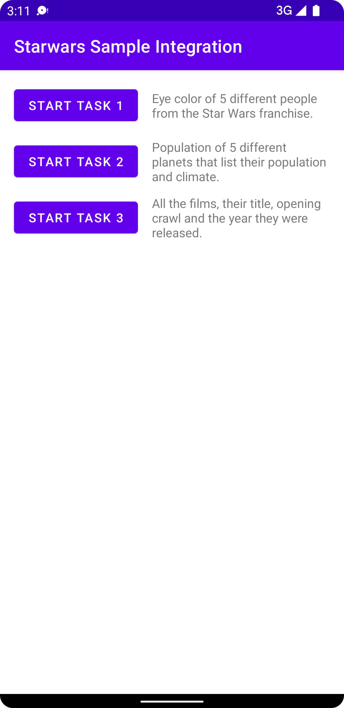
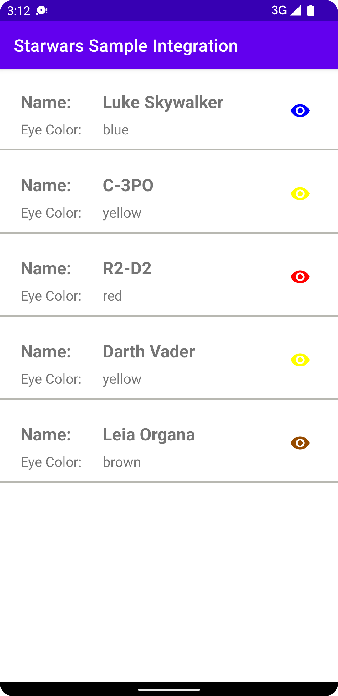
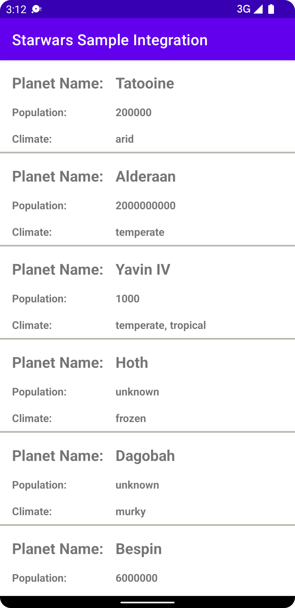
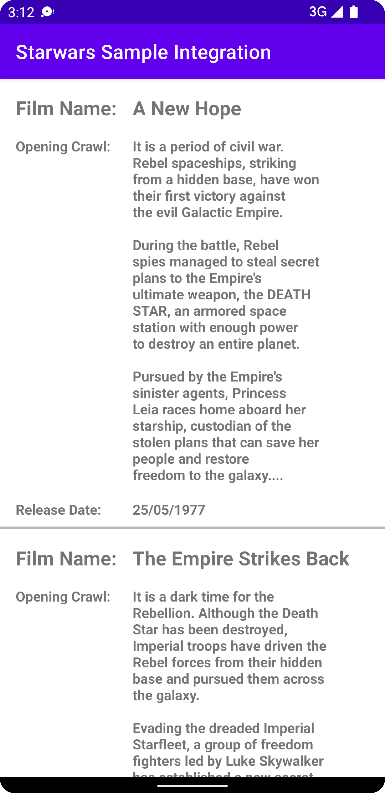

# StarWars Sample Application

This is the implementation of StarWars SDK.

# Getting started

The Sample application demonstrates the tasks that were assigned which are as follows.

- Eye color of 5 different people from the Star Wars franchise. 
- Population of 5 different planets that list their population and climate.
- All the films, their title, opening crawl, and the year they were released.

# Implementation 

The main page displays the option to select each task.

### Tasks
#### Task 1
Task 1 demonstrates the information i.e. Name and Eye Color of 5 people from the movie.

#### Task 2
Task 2 demonstrates the information i.e. Name and Population and Climate of planets from the movie.

#### Task 3
Task 3 presents the information i.e. Name, Opening Crawl, and Release Date of all the movies.

## Future Work

- The application can be expanded to include a search option for all the different information available from the SDK.
- A detailed movie breakdown can be provided with details of the Planets, Species, People, Starships, and Vehicles used in the movies.